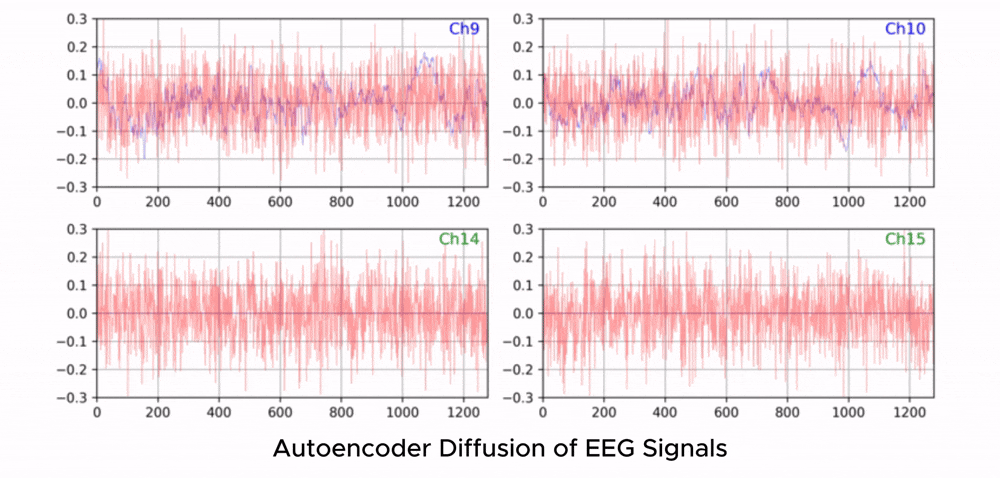
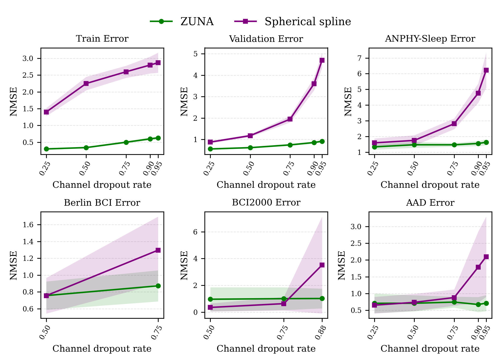

# ZUNA: EEG Foundation Model

[](https://huggingface.co/Zyphra/ZUNA)

ZUNA is a 380M-parameter masked diffusion autoencoder trained to reconstruct, denoise, and upsample scalp-EEG signals. Given a subset of EEG channels, ZUNA can:

- **Denoise** existing EEG channels
- **Reconstruct** missing EEG channels
- **Predict** novel channel signals given physical coordinates on the scalp

ZUNA was trained on approximately 2 million channel-hours of EEG data from a wide range of publicly available sources. At 380M parameters, it is lightweight enough to run on a consumer GPU and can be used on CPU for many workloads.

<p align="center">
  
</p>

## Performance

ZUNA significantly outperforms existing standard methods for channel denoising, reconstruction, and upsampling. We compared ZUNA to MNE's default spherical spline interpolation method. ZUNA outperforms MNE in reconstruction accuracy across a range of unseen datasets, even those with a different preprocessing pipeline. ZUNA's advantage is particularly striking for higher upsampling ratios, demonstrating that it is effectively using general priors learned through large-scale pretraining.

<p align="center">
  
</p>

## Installation

```bash
pip install zuna
```

Or install in development mode:

```bash
git clone https://github.com/Zyphra/zuna.git
cd zuna
pip install -e .
```

## Quick Start

See `tutorials/run_zuna_pipeline.py` for a complete working example. Edit the paths and options, then run:

```bash
python tutorials/run_zuna_pipeline.py
```

Input `.fif` files must have a channel montage set with 3D positions (see [Setting Montages](#setting-montages) below). The pipeline runs 4 steps:

| Step | Function | Description |
|------|----------|-------------|
| 1 | `zuna.preprocessing()` | .fif → .pt (resample, filter, epoch, normalize) |
| 2 | `zuna.inference()` | .pt → .pt (model reconstruction) |
| 3 | `zuna.pt_to_fif()` | .pt → .fif (denormalize, concatenate) |
| 4 | `zuna.compare_plot_pipeline()` | Generate comparison plots |

Model weights are automatically downloaded from HuggingFace on first run.

The pipeline creates this directory structure:

```
working_dir/
    1_fif_filter/     - Preprocessed .fif files (for comparison)
    2_pt_input/       - Preprocessed .pt files (model input)
    3_pt_output/      - Model output .pt files
    4_fif_output/     - Final reconstructed .fif files
    FIGURES/          - Comparison plots
```

## API Reference

For detailed documentation on any function, use `help()`:

```python
import zuna
help(zuna.preprocessing)
help(zuna.inference)
help(zuna.pt_to_fif)
help(zuna.compare_plot_pipeline)
```

## Preprocessing

Preprocess `.fif` files to `.pt` format (resample to 256 Hz, filter, epoch into 5s segments, normalize).

```python
from zuna import preprocessing

preprocessing(
    input_dir="path/to/fif/files",
    output_dir="path/to/working/2_pt_input",
    apply_notch_filter=False,         # Automatic line noise removal
    apply_highpass_filter=True,       # 0.5 Hz highpass
    apply_average_reference=True,     # Average reference
    target_channel_count=['AF3', 'AF4', 'F1', 'F2'],  # Add channels from 10-05 montage
    bad_channels=['Cz', 'Fz'],       # Zero out known bad channels
    preprocessed_fif_dir="path/to/working/1_fif_filter",  # Save filtered .fif for comparison
)
```

Note: Sampling rate (256 Hz), epoch duration (5s), and batch size (64 epochs per file) are fixed to match the pretrained model and should not be changed.

## Inference

Run the ZUNA model on preprocessed `.pt` files. Model weights are downloaded from HuggingFace automatically.

```python
from zuna import inference

inference(
    input_dir="path/to/working/2_pt_input",
    output_dir="path/to/working/3_pt_output",
    gpu_device=0,                     # GPU ID (default: 0), or "" for CPU
    tokens_per_batch=100000,          # Increase for higher GPU utilization
    data_norm=10.0,                   # Normalization denominator (ZUNA expects std=0.1)
    diffusion_cfg=1.0,               # Classifier-free guidance (1.0 = no cfg)
    diffusion_sample_steps=50,        # Diffusion steps
    plot_eeg_signal_samples=False,    # Plot per-sample reconstructions (slow, for debugging)
    inference_figures_dir="./FIGURES", # Where to save per-sample plots
)
```

## Reconstruction

Convert model output `.pt` files back to `.fif` format, reversing normalization and stitching epochs back together.

```python
from zuna import pt_to_fif

pt_to_fif(
    input_dir="path/to/working/3_pt_output",
    output_dir="path/to/working/4_fif_output",
)
```

## Visualization

Generate comparison plots between pipeline input and output.

```python
from zuna import compare_plot_pipeline

compare_plot_pipeline(
    input_dir="path/to/original/fif/files",
    fif_input_dir="path/to/working/1_fif_filter",
    fif_output_dir="path/to/working/4_fif_output",
    pt_input_dir="path/to/working/2_pt_input",
    pt_output_dir="path/to/working/3_pt_output",
    output_dir="path/to/working/FIGURES",
    plot_pt=True,                     # Compare .pt files (epoch-level)
    plot_fif=True,                    # Compare .fif files (full recording)
    num_samples=2,                    # Number of files to compare
)
```

## Setting Montages

Input `.fif` files must have a channel montage with 3D positions. If your files don't have one:

```python
import mne

raw = mne.io.read_raw_fif('data.fif', preload=True)
montage = mne.channels.make_standard_montage('standard_1005')
raw.set_montage(montage)
raw.save('data_with_montage.fif', overwrite=True)
```

## Citation

For more information please see our [technical whitepaper](https://huggingface.co/Zyphra/ZUNA) and [blog](https://huggingface.co/Zyphra/ZUNA). If you find ZUNA useful in your work, please cite accordingly.

Organizations or researchers interested in collaborating with Zyphra to improve future versions for specific needs or use cases should contact bci@zyphra.com.

## Disclaimer

This software and related services ("Services") are provided for research use only and are not intended for use in the diagnosis, cure, mitigation, treatment, or prevention of any disease or health condition. The Services have not been validated for any medical or clinical use. The information provided through the Services is for general informational purposes only and is not a substitute for any professional medical or healthcare advice. We do not warrant that any information provided through the Services is accurate, complete, or useful to you. Any reliance you place on such information is strictly at your own risk.
