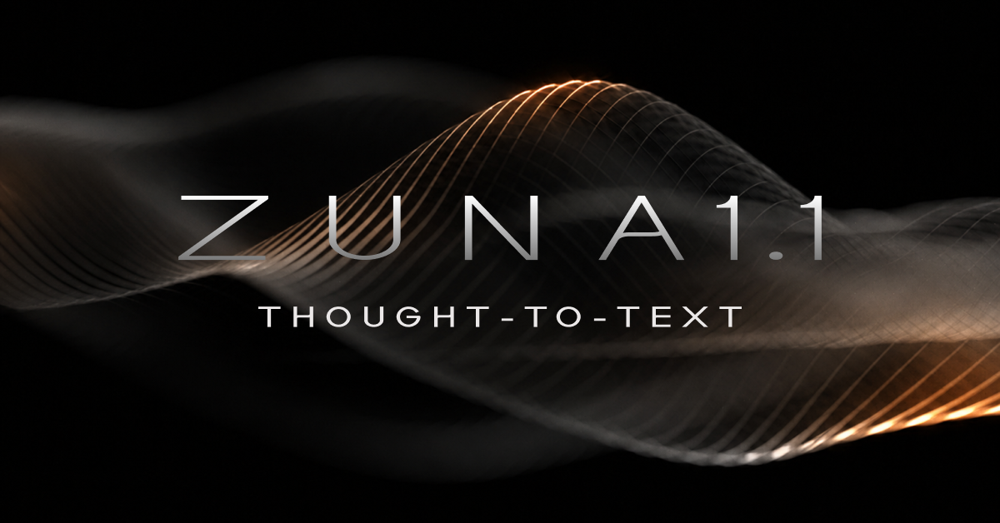
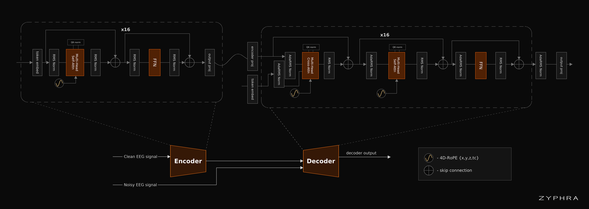
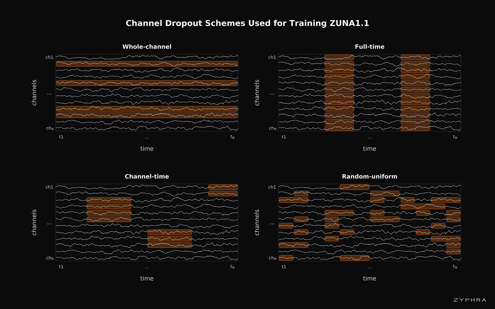
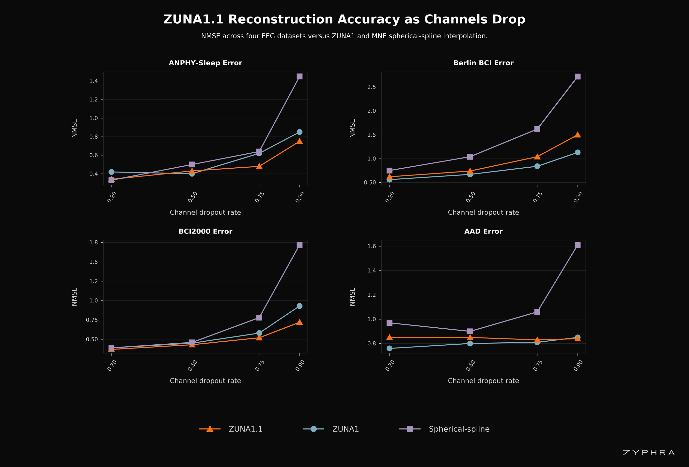
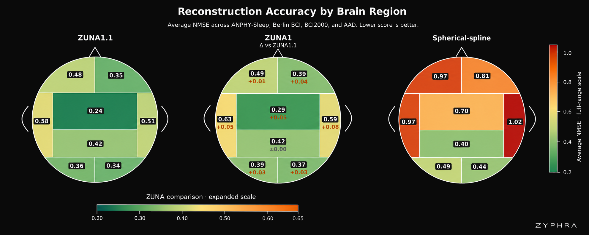
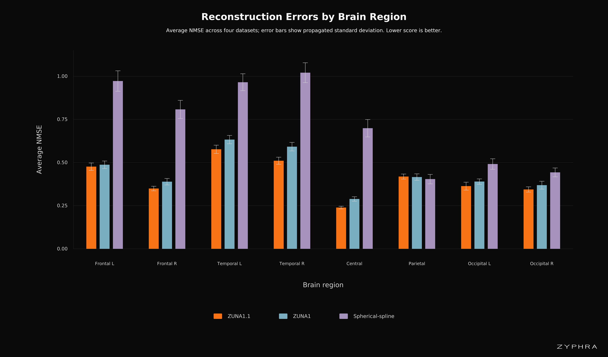

<p align="center">
  
</p>

# ZUNA1.1: A Flexible EEG Foundation Model

[](https://huggingface.co/Zyphra/ZUNA1.1) [](https://pypi.org/project/zuna/)  [](https://discord.gg/ZF7BCgjAcC) [](https://arxiv.org/pdf/2602.18478) [](LICENSE)

**ZUNA1.1** is Zyphra's open foundation model for EEG. It reconstructs noisy or missing channels, denoises recordings, and upsamples sparse electrode layouts to denser ones. Because it conditions on each electrode's **3D scalp coordinates** rather than a fixed channel list, it works on essentially any montage — from a 4-channel Muse headband to a 256-channel research cap — without retraining, and can even generate signals at electrode locations that were never recorded.

- **Denoise** existing EEG channels
- **Reconstruct** missing or dropped channels
- **Upsample** sparse montages — predict novel channels from their scalp coordinates

ZUNA1.1 is a 380M-parameter diffusion autoencoder trained on ~3.5M channel-hours of public EEG. At only 380M parameters it needs **<1 GB of VRAM**, running fast on a consumer GPU or Mac (Apple Silicon) and acceptably on CPU.

> **⚠️ Not a diagnostic tool.** Like any generative model, ZUNA1.1 produces *plausible* reconstructions, not ground-truth measurements, and can hallucinate signals that were never present. Reconstructed channels are imputed data and must not be used as the basis for clinical decisions. See the [Disclaimer](#disclaimer).

## ☁️ Try it in your browser — Zyphra Cloud

No install, no GPU, no code. Upload an EEG recording (`.fif`) — or use a provided sample — to the **[Zyphra Cloud EEG Playground](https://cloud.zyphra.com)**, mark noisy segments (by hand or with auto-select), and denoise or upsample directly in the browser. We host the model and run inference on our servers; nothing is retained after your session, and we do not train on user data.

<!-- TODO: confirm the exact Zyphra Cloud / EEG Playground URL above. -->

## What's new in ZUNA1.1

ZUNA1.1 keeps the architecture of the original [ZUNA1](https://huggingface.co/Zyphra/ZUNA) but is trained to be far more flexible and robust to real-world data, while matching or exceeding ZUNA1's reconstruction quality:

1. **Variable-length inputs (0.5–30 s)** — a segment length is sampled per training example (snapped to the 0.125 s token grid) instead of only fixed 5 s windows, so the same model serves a 0.5 s trial snippet or a 30 s continuous stretch with no reconfiguration.
2. **A richer mixture of reconstruction tasks** — trained on **four** realistic channel-dropout patterns (see [Training](#training)) rather than a single random-dropout scheme, covering the many ways real EEG actually gets corrupted.
3. **Quality-aware preprocessing and a bigger corpus** — a per-channel, per-second quality score recovers signal from partially-noisy channels the old whole-recording pipeline discarded, growing the corpus from ~2M to ~3.5M channel-hours. Two filter variants per recording (a 0.1–45 Hz bandpass and a lighter 0.01 Hz highpass + notch) teach the model to generalize across heterogeneous preprocessing.

## Architecture

<p align="center">
  <br>
  <em>ZUNA1.1 is a transformer encoder–decoder diffusion autoencoder trained to reconstruct masked EEG channels. The main changes from ZUNA1 improve training stability (e.g. additional normalization layers).</em>
</p>

ZUNA slices each EEG channel into short **0.125 s segments (32 samples at 256 Hz)**, turns each into a continuous-valued token, and serializes them in channel × time order. The key idea is the positional encoding: each token carries a **4D rotary positional encoding over (x, y, z, t)** — the electrode's 3D scalp coordinate plus its coarse-time index. Because *position*, not array index, tells the model where a channel sits, ZUNA is **channel-agnostic**: it accepts any number of electrodes in any layout and can synthesize signals at positions that were never recorded (arbitrary upsampling by location). The encoder compresses the signal into a latent that conditions the decoder via adaptive-RMS norm; the decoder is trained with a rectified-flow objective. For full architecture details, see the [ZUNA technical paper](https://www.zyphra.com/zuna-technical-paper).

## Training

ZUNA1.1 was trained on a mixture of **four channel-dropout schemes**, each capturing a different way EEG gets corrupted or goes missing:

- **Whole-channel** — entire channels removed (sparse montages, dead electrodes).
- **Full-time** — short time stretches removed across *every* channel (whole-signal dropouts, head-movement bursts).
- **Channel-time** — those same time stretches removed from *some* channels only (gaps clustered in space and time, e.g. motion artifacts on nearby electrodes).
- **Random-uniform** — missing values scattered across individual points (transient, localized noise like a muscle twitch).

<p align="center">
  <br>
  <em>ZUNA1.1's dropout schemes are far more diverse than ZUNA1, which dropped entire channels over all time. Training across this mixture lets ZUNA1.1 handle almost arbitrary reconstructions across space and time.</em>
</p>

## Performance

Adding this flexibility comes at no obvious cost in reconstruction quality. On held-out evaluations, ZUNA1.1 reaches better or essentially the same NMSE as ZUNA1, and both clearly outperform classical spherical-spline interpolation — the gap widening as more channels go missing, where spline interpolation (which only assumes spatial smoothness) breaks down.

<p align="center">
  <br>
  <em>Reconstruction NMSE vs channel-dropout rate across four datasets — ZUNA1.1 vs ZUNA1 vs MNE spherical-spline interpolation. Lower is better. (Evaluation restricted to 5 s samples for comparison with ZUNA1.)</em>
</p>

We also evaluate a more experimentally realistic setup: delete every electrode in one brain region and reconstruct it from the remaining seven regions. ZUNA1.1 leads across regions.

<p align="center">
  <br>
  <em>Per-region reconstruction NMSE (topographic view): ZUNA1.1, ZUNA1 (Δ vs ZUNA1.1), and spherical-spline. Lower/greener is better.</em>
</p>

<p align="center">
  <br>
  <em>The same per-region errors as a bar chart, averaged across four datasets; error bars show propagated standard deviation. Lower is better.</em>
</p>

## Installation

```bash
# (1) Clone the repo (for the tutorial + sample data)
git clone https://github.com/Zyphra/zuna.git && cd zuna

# (2) Install zuna
pip install zuna
```

Or install in development mode:

```bash
git clone https://github.com/Zyphra/zuna.git && cd zuna
pip install -e .
```

### GPU support (PyTorch + CUDA)

`zuna` runs on the GPU via PyTorch, and **PyPI cannot pick a PyTorch build that matches your GPU driver for you**. If the automatically installed `torch` is built for a newer CUDA version than your NVIDIA driver supports, PyTorch silently falls back to CPU (very slow) with a warning like `No CUDA runtime is found` / `CUDA initialization: The NVIDIA driver on your system is too old`.

To avoid this, install a `torch` build that matches your driver **before** installing `zuna`. Check the CUDA version your driver supports (top-right of `nvidia-smi`), then install the matching wheel — for example, for CUDA 12.8:

```bash
# 1. Install a torch build matching your driver's CUDA version (see `nvidia-smi`).
#    Example for CUDA 12.8 — use cu121 / cu124 / cu126 / cu128 to match yours:
pip install torch --index-url https://download.pytorch.org/whl/cu128

# 2. Then install zuna (it will use the torch you already installed)
pip install zuna
```

If you already installed `zuna` and it's running on CPU, fix it by reinstalling the matching torch:

```bash
pip install --force-reinstall torch --index-url https://download.pytorch.org/whl/cu128
```

Verify GPU access:

```bash
python -c "import torch; print(torch.__version__, torch.version.cuda, torch.cuda.is_available())"
# Expect the CUDA build (e.g. ...+cu128) and `True`.
```

## Quick Start

`tutorials/run_zuna_pipeline_new.py` is a complete, editable example. It reads `.fif` files from an input directory, reconstructs the selected cells with the model, and writes `.fif` files back out (no `.pt` round-trip). Edit the constants at the top, then run:

```bash
python tutorials/run_zuna_pipeline_new.py
```

Model weights download from HuggingFace automatically on first run. Outputs land under `OUTPUT_DIR`:

```
2_fif_output/
    full_reconstruction/<name>_raw.fif   # model output everywhere
    hybrid/<name>_raw.fif                # original input, model output ONLY on the inferred cells
    hybrid/<name>_mask.npz               # per (channel, token) mask of what was inferred
figures/
    <name>__full_reconstruction.png      # full-duration input-vs-reconstruction overlay
    <name>__hybrid.png
```

> **Input `.fif` files should have electrode 3D positions.** If yours don't, either pass a `montage` (used to add standard positions by channel name) or set one yourself — see [Setting Montages](#setting-montages). For best results use continuous raw EEG (or long continuous segments) rather than short pre-cut epochs, which introduce filter edge artifacts. ZUNA1.1 operates at 256 Hz and accepts 0.5–30 s of signal per model pass.

## Reconstructing `.fif` files: `reconstruct_fif`

The runner calls one function, which you can also use directly:

```python
from zuna import reconstruct_fif

reconstruct_fif(
    input_dir="path/to/fif/input",
    output_dir="path/to/fif/output",
    figures_dir="path/to/figures",
    gpu_device=0,                # GPU id, or "" for CPU
    highpass_hz=0.5,             # highpass applied before the model (None to skip)
    montage="standard_1020",     # used only to add positions when a .fif lacks them
)
```

**The reconstruction mask is the UNION of every source below** — nothing overrides anything else, so you can combine automatic detection with manual selections freely.

### Automatic: MNE bad channels + `BAD_` annotations

If your `.fif` already marks bad data with MNE, ZUNA uses it with no extra arguments:

- **`info['bads']`** — any channel flagged bad is reconstructed in full (always used).
- **`BAD_*` annotations** — time spans annotated bad (across all channels) are reconstructed. Toggle with `use_fif_annotations` (default `True`).

```python
reconstruct_fif(..., use_fif_annotations=True)   # import the .fif's own BAD_ time annotations
```

### Repair specific channels (even if not marked bad)

Name channels to reconstruct completely, whether or not they're flagged in the file:

```python
reconstruct_fif(..., repair_channels=["Cz", "Fz"])
```

### Add channels / upsample the montage

Predict brand-new channels at their scalp positions. Pass **names** to add exactly those, or an **integer** to auto-add up to that many total channels, placed far from existing electrodes:

```python
reconstruct_fif(..., target_channel_count=["Fz", "Pz"])   # add these exact channels
reconstruct_fif(..., target_channel_count=40)              # auto-upsample to 40 channels total
```

### Reconstruct manual time segments

Pass a list of tuples, in **data-relative seconds**. A 2-tuple marks that span bad on **all** channels; a 3-tuple restricts it to **one** channel:

```python
reconstruct_fif(..., bad_segments=[
    (5, 6),            # 5–6 s bad on ALL channels
    (10, 11, "C3"),    # 10–11 s bad on C3 only
    (10, 11, "C4"),    # 10–11 s bad on C4 only
])
```

### Drive it from a UI / external mask

For a UI (or any external tool), supply a directory of per-file masks. Each `<base>_mask.npz` holds a `(channel × token)` boolean array (one column per `num_fine_time_pts` = 32 samples ≈ 0.125 s; sample-resolution is also accepted), plus `ch_names` and `sfreq`. It is unioned with everything above:

```python
reconstruct_fif(..., mask_dir="path/to/masks")
```

You can build such a mask from bad channels + time segments with the helper `zuna.write_bad_mask(...)`, which emits the same format the reconstructor writes to `hybrid/<base>_mask.npz` — so a UI can round-trip it.

## Setting Montages

ZUNA needs electrode 3D positions. If your `.fif` doesn't carry a montage:

```python
import mne

raw = mne.io.read_raw_fif("data.fif", preload=True)
raw.set_montage(mne.channels.make_standard_montage("standard_1005"))
raw.save("data_with_montage.fif", overwrite=True)
```

Any montage with known positions works — consumer-headset layouts as well as standard 8/16/32/64-channel research montages up to 256-channel systems.

## Citation

For more information see our [technical whitepaper](https://www.zyphra.com/zuna-technical-paper) and [blog](https://www.zyphra.com/post/zuna). If you find ZUNA useful in your work, please cite accordingly.

Organizations or researchers interested in collaborating with Zyphra to improve future versions for specific needs or use cases should contact bci@zyphra.com.

## Disclaimer

This software and related services ("Services") are provided for research use only and are not intended for use in the diagnosis, cure, mitigation, treatment, or prevention of any disease or health condition. The Services have not been validated for any medical or clinical use. The information provided through the Services is for general informational purposes only and is not a substitute for any professional medical or healthcare advice. We do not warrant that any information provided through the Services is accurate, complete, or useful to you. Any reliance you place on such information is strictly at your own risk.
